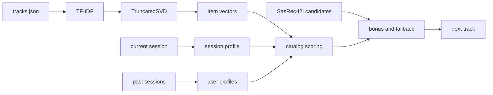

## Homework 2 Report

### Abstract
В экспериментальной группе я использовал рекомендер `SessionSemantic`. Он работает в семантическом пространстве треков, но при этом учитывает не только текущую сессию, а ещё и накопленные интересы пользователя между сессиями. Для выбора следующего трека алгоритм смешивает несколько сигналов: текущий профиль сессии, ближайший пользовательский профиль и подсказки из готовых списков кандидатов. На локальной проверке такой подход давал заметно лучший результат, чем `SasRec-I2I`.

### Детали
Сначала для всех треков строятся 64-мерные векторы по открытым метаданным из `botify/data/tracks.json`. Для этого из `title`, `artist`, `mood`, `genres`, `artist_genres`, `year` и `summary` собирается текст, после чего применяется `TF-IDF -> TruncatedSVD`. Эти векторы загружаются при старте сервиса и дальше используются для всех вычислений.

Во время работы алгоритм хранит два вида состояния. Первый — текущая сессия пользователя: по последним прослушиваниям строится профиль текущего интереса. Второй — несколько устойчивых профилей пользователя, которые обновляются после завершения сессии. При выдаче рекомендации алгоритм оценивает профиль текущей сессии по наблюдаемым `time`, выбирает наиболее подходящий пользовательский профиль, смешивает их и ранжирует каталог по близости в этом пространстве. Повторы треков запрещены, повтор артистов штрафуется. Кандидаты из `SasRec-I2I` используются как запасной вариант и как слабый дополнительный сигнал. Схема A/B-теста честная: в контроле `Treatment.C -> SasRec-I2I`, в экспериментальной группе `Treatment.T1 -> SessionSemantic`.

### Результаты A/B
Для локальной оценки этой версии я прогонял A/B-тест отдельно и считал метрики тем же `analyze_ab.py`, что используется в репозитории. Основная метрика `mean_time_per_session` показала устойчивый положительный прирост относительно контроля.

| группа | пользователи | mean_time_per_session | эффект к C | 95% CI | значимо |
|---|---:|---:|---:|---:|---:|
| C (`SasRec-I2I`) | 4754 | 6.8650 | - | - | - |
| T1 (`SessionSemantic`) | 4759 | 10.8243 | +57.67% | [+53.96%; +61.39%] | да |
