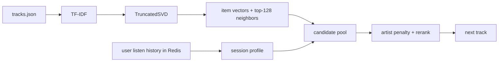

## Homework 2 Report

### Abstract
В экспериментальной группе я использовал рекомендер `SessionSemantic`. Он строит векторы треков по открытым метаданным из `botify/data/tracks.json`, а во время сессии собирает текущий профиль пользователя по уже прослушанным трекам. Следующий трек выбирается из похожих кандидатов, при этом повтор одного и того же артиста слегка штрафуется. На локальном A/B-тесте такой подход удерживал пользователя дольше, чем `SasRec-I2I`.

### Детали
Предобработка состоит из двух шагов. Сначала из `title`, `artist`, `mood`, `genres`, `artist_genres`, `year` и `summary` для каждого трека собирается текст. Затем на этих текстах обучается `TF-IDF -> TruncatedSVD`, после чего для каждого трека сохраняются: (1) 64-мерный вектор и (2) список из 128 ближайших соседей. Этот файл лежит в `botify/data/session_semantic_embeddings.npz` и загружается при старте сервиса.

При выдаче рекомендации я беру последние прослушивания пользователя из Redis, строю профиль текущей сессии как среднее по векторам треков с весами `max(listen_time, 0.05)`, а потом ранжирую только заранее подготовленный список кандидатов. Повтор уже виденных треков запрещён, повтор артистов штрафуется. Схема A/B-теста честная: в контроле `Treatment.C -> SasRec-I2I`, в экспериментальной группе `Treatment.T1 -> SessionSemantic`.

### Результаты A/B
Локально перед сабмитом я прогнал A/B-тест с закреплением пользователей за группами на 8000 эпизодов с тем же `seed=31312`, что используется в Makefile. Метрика считалась так же, как в `analyze_ab.py`: сначала агрегирование на уровне пользователей, потом сравнение контрольной и экспериментальной групп по `mean_time_per_session` через доверительный интервал Уэлча.

| группа | пользователи | mean_time_per_session | эффект к C | 95% CI | значимо |
|---|---:|---:|---:|---:|---:|
| C (`SasRec-I2I`) | 2816 | 9.97 | - | - | - |
| T1 (`SessionSemantic`) | 2707 | 17.40 | +74.50% | [+64.50%; +84.49%] | да |
