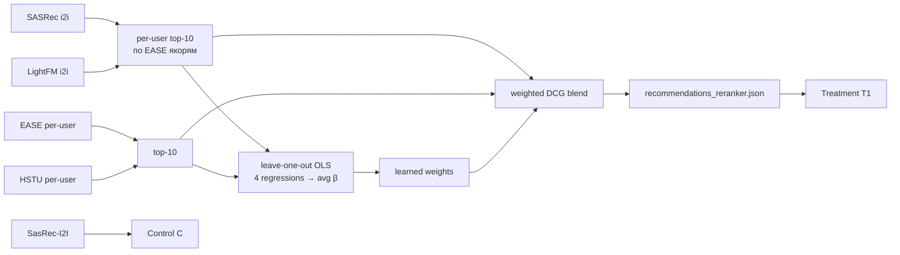

## Homework 2 Report — Learned-to-Rank blender над SASRec + EASE + HSTU + LightFM

### Abstract
Тритмент обслуживается ML-реранкером, который для каждого юзера смешивает top-10 кандидатов от четырёх моделей — `SASRec`, `EASE`, `HSTU`, `LightFM`. Веса моделей **обучены**: leave-one-out OLS прячет top-10 одной модели и учит по трём остальным предсказывать, был ли трек в её top-10. Итоговые веса — среднее коэффициентов по четырём прогонам. Контроль `C` — чистый SasRec-I2I, тритмент `T1` — ML-реранкер.

### Детали
Per-user моделей (EASE, HSTU) берём топ-10 напрямую. Для i2i (SASRec, LightFM) собираем per-user топ-10 по 5 якорям из EASE (fallback HSTU) с агрегацией `pos_w(anchor) · pos_w(cand)`, `pos_w(p) = 1 / log₂(2 + p)`. Тренер [jupyter/train_blender.py](jupyter/train_blender.py) решает 4 OLS-системы в закрытой форме (ridge λ=1e-3), усредняет β и max-нормирует. Учёные веса: **SASRec=1.0, LightFM=0.76, EASE=0.24, HSTU=0.04**. Финальный скор `score(t) = Σₘ Wₘ · pos_w(rankₘ(t))` сортируется в топ-10 и пишется в `botify/data/recommendations_reranker.json`. Онлайн [botify/botify/recommenders/reranker.py](botify/botify/recommenders/reranker.py) фильтрует прослушанное через `listen_history`, выдаёт трек с геом. биасом `p=0.6` к вершине, fallback — SasRec-I2I.

### Результаты A/B эксперимента