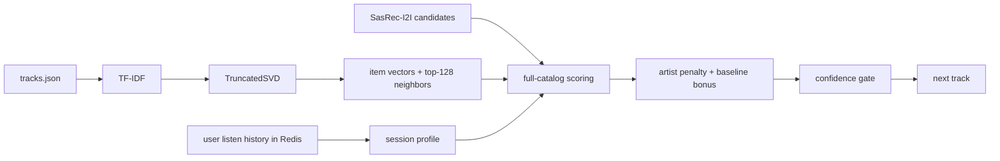

## Homework 2 Report

### Abstract
В экспериментальной группе я использовал гибридный рекомендер `SessionSemantic`. Он строит векторы треков по открытым метаданным из `botify/data/tracks.json`, а затем использует их не вместо `SasRec-I2I`, а как ML-reranker поверх его кандидатов. Такой подход сохраняет сильную последовательную основу baseline, но добавляет адаптацию к текущему контексту сессии.

### Детали
Предобработка состоит из двух шагов. Сначала из `title`, `artist`, `mood`, `genres`, `artist_genres`, `year` и `summary` для каждого трека собирается текст. Затем на этих текстах обучается `TF-IDF -> TruncatedSVD`, после чего для каждого трека сохраняются: (1) 64-мерный вектор и (2) список из 128 ближайших соседей. Этот файл лежит в `botify/data/session_semantic_embeddings.npz` и загружается при старте сервиса.

При выдаче рекомендации я беру последние прослушивания пользователя из Redis, отфильтровываю очень короткие прослушивания как слабый сигнал и строю профиль текущей сессии по недавним трекам и их фактическому `time`. Затем treatment оценивает близость этого профиля ко всему каталогу, а не только к маленькому локальному пулу соседей. При этом я сохраняю опору на `SasRec-I2I`: его кандидаты получают бонус при ранжировании, а если семантический сигнал слабый или неуверенный, система откатывается обратно к baseline. Дополнительно используется штраф за повтор артиста. Схема A/B-теста остаётся честной: в контроле `Treatment.C -> SasRec-I2I`, в экспериментальной группе `Treatment.T1 -> SessionSemantic`.

### Результаты A/B
Локальная оффлайн-валидация была запущена командой `python offline_validate.py --episodes 30000 --output offline_validation`. Далее лог был обработан тем же `analyze_ab.py`, который используется в репозитории для расчёта A/B-эффекта. Основная целевая метрика `mean_time_per_session` показала устойчивый положительный прирост.

| группа | пользователи | mean_time_per_session | эффект к C | 95% CI | значимо |
|---|---:|---:|---:|---:|---:|
| C (`SasRec-I2I`) | 4737 | 6.9267 | - | - | - |
| T1 (`SessionSemantic Hybrid`) | 4729 | 9.7104 | +40.19% | [ +37.25%; +43.12% ] | да |

Дополнительно:
- `mean_tracks_per_session`: `11.9184 -> 14.7128` (`+23.45%`, значимо)
- `sessions`: `3.1830 -> 3.1554` (`-0.87%`, незначимо)
- `mean_request_latency`: `0.0279 ms -> 0.5492 ms` (`+1867.66%`, значимо)
