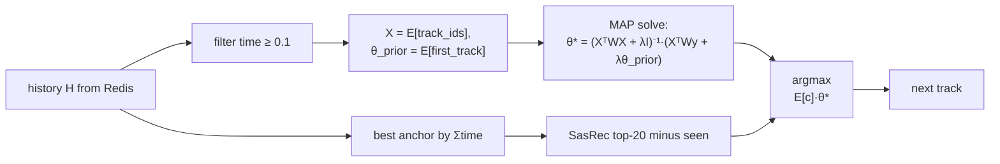

# Homework 2 Report — MAPSession recommender

## Abstract

Тритмент — `MAPSession`: per-session Bayesian MAP-инференс скрытого вектора интереса `θ` по наблюдаемым `(track, listen_time)` парам текущей сессии, с последующим переранжированием SasRec-кандидатов по `θ·E[c]`.  
Item-эмбеддинги `E ∈ R^{N×64}` обучены оффлайн time-weighted MF на собранных симуляторных логах: цель `E[first]·E[played] ≈ logit(time)`.  
Это **online**-алгоритм — `θ` оценивается на каждом запросе по динамической истории; никакой статической `top-K` таблицы не предвычисляется.

## Детали

#### **Обучение эмбеддингов** (`script/train_session_embeddings.py`)
- Парсим логи симулятора, из каждой сессии извлекаем тройки `(first_track, played_track, listen_time)`. Один эмбеддинг-матриц `E` (shared для first/played), Adam, batch 4096, 30 эпох с early-stop, MSE с `weight = listen_time` и `target = logit(clip(time, 0.01, 0.99))`. 
  
- Логика: в симуляторе `time = σ((emb·session_interest − bias)·sharp)`, где `session_interest = E_sim[first_track]`. Минимизируя MSE между `E[first]·E[played]` и `logit(time)`, восстанавливаем геометрию, в которой dot-product коррелирует с reward, не имея доступа к `sim/data/embeddings.npy`.

- Эмбеддинги сериализуются в `botify/data/session_embeddings.jsonl`.

#### **Online inference** (`botify/botify/recommenders/map_session.py`)
- На `/next` подгружаем историю `H = [(t_i, time_i)]` (до 10 треков) из Redis, фильтруем `time ≥ 0.1` (low-time → шум репитов и ранних skip'ов). 
- Решаем закрыто-формульную ridge-регрессию `θ* = (XᵀWX + λI)⁻¹(XᵀWy + λθ_prior)` где `X = E[track_ids]`, `y_i = logit(time_i)`, `w_i = time_i`, `θ_prior = E[first_track]`.  Кандидаты -- top-20 SasRec для самого «горячего» якоря (по weighted listen_time), минус seen. 
- Финальный выбор: `argmax θ·E[c]`. Fallback на оригинальный SasRec-I2I при пустой истории, < 2 активных пар или сингулярном `A`.

## Результаты

A/B на $30.000$ эпизодов симулятора, seed=31312, half/half split (`MAP_SESSION` эксперимент в `experiment.py`). 

`C = sasrec_i2i_recommender`, `T1 = map_session_recommender`

| metric | C mean | T1 mean | effect_pct | 95% CI | significant |
|---|---:|---:|---:|---|:---:|
| **mean_time_per_session** | **6.9302** | **8.7462** | **+26.20%** | **[+24.03, +28.38]** | **✅** |
| mean_tracks_per_session | 11.91 | 13.73 | +15.27% | [+13.93, +16.61] | ✅ |
| time (total user time) | 21.61 | 27.68 | +28.13% | [+24.87, +31.39] | ✅ |
| sessions | 3.165 | 3.162 | −0.09% | [−2.18, +1.99] | ❌ |
| mean_request_latency, ms | 0.444 | 0.542 | +22.14% | [+21.91, +22.37] | ✅ |