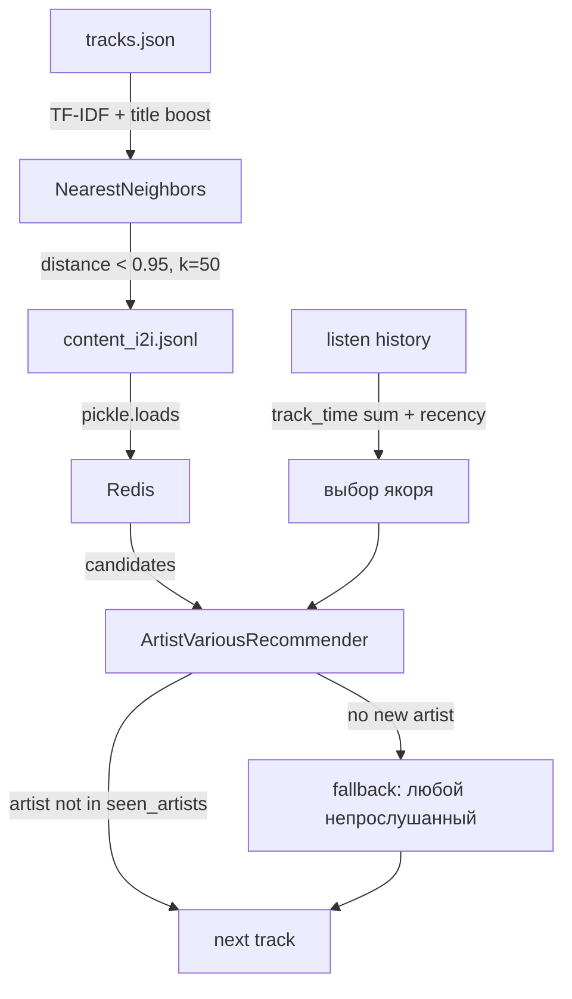
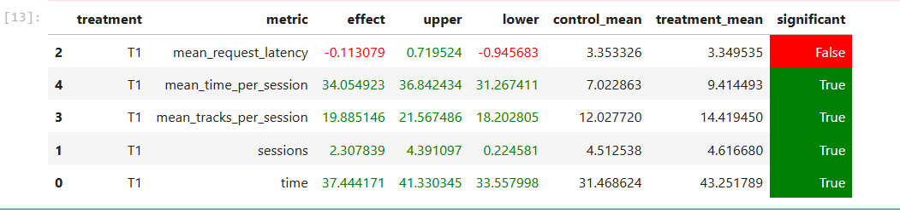

# Homework 2 Report

## Abstract

В эксперименте проверяется гипотеза: принудительное переключение между разными исполнителями увеличивает вовлечённость пользователей. Для этого в treatment-группе внедрён `ArtistVariousRecommender` — content-based recommender, который при выборе следующего трека отдаёт приоритет артистам, ещё не встречавшимся в истории прослушиваний. Модель строится на TF-IDF векторах из текстового описания треков (название, жанры, настроение, страна артиста) с усилением значимости заголовка. Такой подход позволяет рекомендовать семантически похожие треки, но от разных исполнителей, снижая эффект "застревания" в одном круге артистов.

## Details

Контрольная группа получает рекомендации от стандартного `SasRec-I2I`, который опирается на поведенческие паттерны. Treatment использует `ArtistVariousRecommender`, работающий по следующей схеме: из Redis загружается история прослушиваний пользователя, среди треков выбирается якорь с максимальным суммарным временем прослушивания (при равенстве — более свежий). Для этого якоря из Redis достаются предвычисленные кандидаты — ближайшие соседи по TF-IDF пространству. Кандидаты генерируются офлайн-скриптом `build_content_i2i.py`: для каждого трека строится TF-IDF вектор из объединённых текстовых полей (название, mood, artist_genre, artist_country, genres, artist_genres, summary), причём название добавляется дважды для увеличения веса. Затем считаются 50 ближайших соседей по косинусной близости с отсечением по порогу 0.95, результат сохраняется в `content_i2i.jsonl` и загружается в Redis. Онлайн-алгоритм перебирает кандидатов в порядке убывания близости к якорю, пропускает уже прослушанные треки и возвращает первого, чей исполнитель отсутствует во множестве `seen_artists`. Если таких нет — берётся любой непрослушанный трек (backup). Полный fallback — стандартный рекомендер при отсутствии истории или кандидатов.

## Results

A/B тест проведён на 10 тысячах эпизодов. Treatment уверенно обыгрывает контроль по всем поведенческим метрикам. Самый сильный эффект — на суммарном времени прослушивания: +37.4% (с 31.47 до 43.25). Время на одну сессию выросло на 34.1% (с 7.02 до 9.41), количество треков за сессию — на 19.9% (с 12.03 до 14.42). Число сессий также увеличилось на 2.3% (с 4.51 до 4.62) — пользователи стали не только слушать дольше, но и возвращаться чаще. Латенси запросов осталась на прежнем уровне (-0.1% в пределах погрешности). Все изменения, кроме латенси, статистически значимы при 95% доверии.

