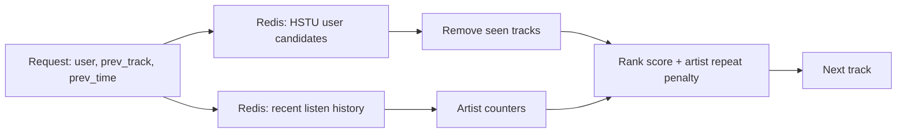

## Homework 2 Report

### Abstract

В качестве улучшения botify используется двухэтапный рекомендатель. offline HSTU-модель формирует персональный список кандидатов для пользователя, а online-слой на стороне сервиса делает лёгкий context-aware reranking. Контрольная группа остаётся неизменной. Пользователям показывается SasRec-I2I. В treatment показывается HSTU-based рекомендатель, который сохраняет порядок ML-кандидатов, но не отдаёт уже прослушанные в текущем контексте треки и снижает приоритет артистов, которые уже повторялись в сессии.

### Детали реализации

Кандидаты загружаются из `data/hstu_recommendations.json` в Redis при старте сервиса. Для каждого запроса `/next/<user>` рекомендатель берёт top-N кандидатов пользователя, читает короткую историю последних прослушиваний из Redis и выбирает лучший трек по скору: базовый скор зависит от позиции в HSTU-ранжировании, а затем умножается на мягкий штраф за повтор артиста. Если предыдущий трек был быстро пропущен, повтор того же артиста штрафуется сильнее. Это не меняет контрольный SasRec-I2I и не использует данные из `sim`.

### Результаты A/B эксперимента

