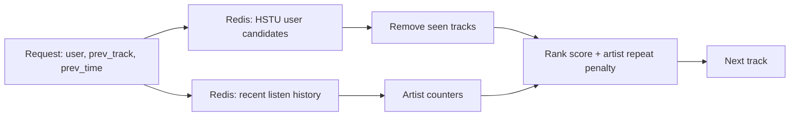

## Homework 2 Report

### Abstract

В качестве улучшения botify используется двухэтапный рекомендатель. offline HSTU-модель формирует персональный список кандидатов для пользователя, а online-слой на стороне сервиса делает лёгкий context-aware reranking. Контрольная группа остаётся неизменной. Пользователям показывается SasRec-I2I. В treatment показывается HSTU-based рекомендатель, который сохраняет порядок ML-кандидатов, но не отдаёт уже прослушанные в текущем контексте треки и снижает приоритет артистов, которые уже повторялись в сессии.

### Детали реализации

Кандидаты загружаются из `data/hstu_recommendations.json` в Redis при старте сервиса. Для каждого запроса `/next/<user>` рекомендатель берёт top-N кандидатов пользователя, читает короткую историю последних прослушиваний из Redis и выбирает лучший трек по скору: базовый скор зависит от позиции в HSTU-ранжировании, а затем умножается на мягкий штраф за повтор артиста. Если предыдущий трек был быстро пропущен, повтор того же артиста штрафуется сильнее. Это не меняет контрольный SasRec-I2I и не использует данные из `sim`.

### Результаты A/B эксперимента

В A/B-тесте контроль — SasRec-I2I, treatment — описанный выше HSTU context reranker. Целевая метрика — `mean_time_per_session`. На предварительном прогоне treatment статистически значимо выигрывает у контроля.

| treatment | metric | effect_pct | lower_pct | upper_pct | control_mean | treatment_mean | significant |
|---|---:|---:|---:|---:|---:|---:|---:|
| T1 | mean_time_per_session | 45.60 | 41.68 | 49.52 | 2.0514 | 2.9869 | True |
| T1 | mean_tracks_per_session | 13.42 | 12.25 | 14.59 | 7.0469 | 7.9925 | True |
| T1 | time | 45.62 | 40.79 | 50.25 | 30.9429 | 45.0273 | True |
| T1 | sessions | 0.44 | -1.46 | 2.35 | 15.0268 | 15.0937 | False |
