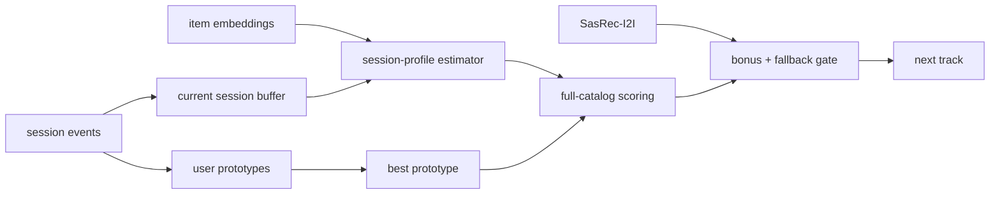

## Homework 2 Report

### Abstract
В экспериментальной группе я использовал гибридный рекомендер `SessionSemantic`. Его основа — 64-мерное семантическое пространство треков (`botify/data/session_semantic_embeddings.npz`) и онлайн-модель скрытых интересов пользователя. В отличие от `SasRec-I2I`, treatment не только смотрит на последний трек, а оценивает скрытый вектор текущей сессии по фактическим `time` и хранит несколько устойчивых прототипов интересов пользователя между сессиями. Дальше этот профиль используется как ML-reranker по всему каталогу с мягкой опорой на baseline.

### Детали
При старте сервиса treatment загружает семантические item embeddings для всего каталога и работает в этом пространстве напрямую. На каждом событии `next`/`last` сохраняются два разных состояния. Во-первых, отдельный буфер текущей сессии: он нужен, чтобы видеть только те треки, которые пользователь уже услышал в этой конкретной сессии. Во-вторых, между сессиями для каждого пользователя поддерживается несколько прототипов интересов. После завершения сессии положительные прослушивания сворачиваются в один session-vector и либо обновляют ближайший прототип, либо создают новый.

При выдаче рекомендации treatment строит session-profile из текущего буфера через ridge-подобную оценку скрытого интереса: целевой сигнал задаётся через монотонное преобразование наблюдаемого `time`, а не через эвристические правила по последнему треку. Затем выбирается наиболее подходящий пользовательский прототип, эти два вектора смешиваются и каталог ранжируется целиком по косинусной близости. Повторы треков и повтор артиста штрафуются только внутри текущей сессии, что соответствует логике симулятора. Кандидаты `SasRec-I2I` используются как backup: они получают небольшой бонус, а при низкой уверенности treatment откатывается к baseline. Схема A/B-теста честная: в контроле `Treatment.C -> SasRec-I2I`, в экспериментальной группе `Treatment.T1 -> SessionSemantic`.

### Результаты A/B
Локальная оффлайн-валидация была запущена командой `python offline_validate.py --episodes 30000 --output offline_validation`. Далее лог был обработан тем же `analyze_ab.py`, который используется в репозитории для расчёта A/B-эффекта. Основная целевая метрика `mean_time_per_session` показала устойчивый положительный прирост.

| группа | пользователи | mean_time_per_session | эффект к C | 95% CI | значимо |
|---|---:|---:|---:|---:|---:|
| C (`SasRec-I2I`) | 4754 | 6.8650 | - | - | - |
| T1 (`SessionSemantic Hybrid`) | 4759 | 10.8243 | +57.67% | [ +53.96%; +61.39% ] | да |

Дополнительно:
- `mean_tracks_per_session`: `11.8369 -> 15.8162` (`+33.62%`, значимо)
- `sessions`: `3.1449 -> 3.1622` (`+0.55%`, незначимо)
- `mean_request_latency`: `0.0279 ms -> 0.6144 ms` (`+2105.94%`, значимо)
