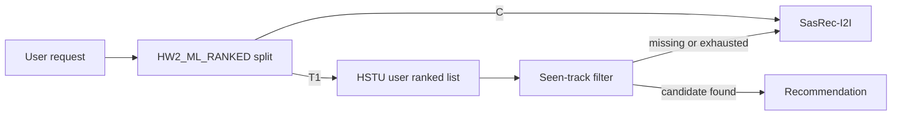

## Abstract

The treatment replaces random serving of the existing ML-generated HSTU user recommendation lists with deterministic ranked serving. Control remains the original SasRec-I2I recommender; treatment reads precomputed user-level HSTU rankings, skips tracks already listened to in the current service history, and falls back to SasRec-I2I when a user list is missing, invalid, or exhausted.

## Details

Botify keeps the same A/B split shape: `C` is SasRec-I2I and `T1` is the proposed ML treatment. The online treatment is intentionally small and reproducible: HSTU recommendations are loaded into Redis at startup, then each request returns the first unseen track from the user's ranked list. No random shuffle is used in treatment serving.

## A/B Results

| Treatment | Metric | Control | Treatment | Lift | Significant |
|---|---|---:|---:|---:|---|
| HW2_ML_RANKED | mean_time_per_session | pending CI run | pending CI run | pending CI run | pending CI run |

Final CI/PR results will be copied into this table after the GitHub check finishes.
