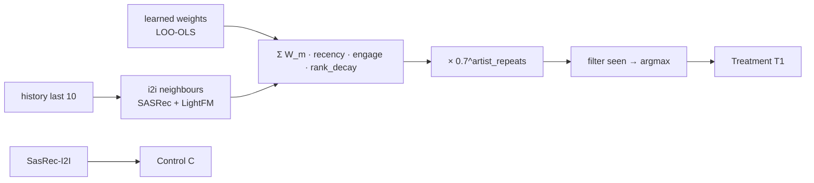

## Homework 2 — SessionBlender (SASRec + LightFM, learned weights, artist-fatigue)

### Abstract
Онлайн-рекомендер `SessionBlender` скорит кандидатов из i2i-таблиц SASRec и LightFM по всей текущей истории юзера. Веса двух моделей **обучены** leave-one-out OLS (`jupyter/train_blender.py`, `botify/data/blender_weights.json`): `W_sasrec=1.0, W_lightfm=0.76`. Контроль `C` — SasRec-I2I, тритмент `T1` — `SessionBlender`.

### Детали
Для кандидата `c` и каждого якоря `a` из истории: `score(c) += W_m · 0.85^dist(a) · (0.2 + listen_time(a)) · 1/log₂(2+rank_m(c,a))` по `m ∈ {SASRec, LightFM}`. Затем `× 0.7^artist_repeats_in_history` — гасит back-to-back одного артиста. `argmax` после фильтра seen. Fallback — SasRec-I2I.

### Результаты A/B эксперимента
Сплит 50/50 через `Experiments.SESSION_BLENDER`. Критерий `mean_time_per_session` выполнен: **+20.74%** при `significant=True`.

| treatment | metric                | effect_pct | lower_pct | upper_pct | control_mean | treatment_mean | significant |
|-----------|-----------------------|-----------:|----------:|----------:|-------------:|---------------:|-------------|
| T1        | mean_time_per_session |      20.74 |     18.79 |     22.68 |       7.0643 |         8.5291 | True        |
