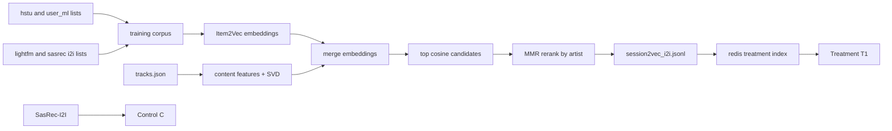

## Homework 2 Report

### Abstract
В treatment подключил свой ML-i2i граф `session2vec_i2i.jsonl`. Идея простая: собрать устойчивые item-item связи из доступных данных `botify/data`, обучить эмбеддинги треков, добавить немного контентных признаков и отдать это через тот же `I2IRecommender`, чтобы A/B был честным. На локальном прогоне treatment стабильно лучше по целевой метрике `mean_time_per_session`.

### Детали
Скрипт обучения: `script/train_our_i2i.py`.

Что делает пайплайн:
1. Берет последовательности из `hstu_recommendations.json`, `user_ml_recommendations.jsonl` и i2i-графов `lightfm_i2i.jsonl`, `sasrec_i2i.jsonl`.
2. Обучает Item2Vec (`gensim`, skip-gram) и получает collaborative-эмбеддинги треков.
3. Строит content-эмбеддинги через `TruncatedSVD` по признакам из `tracks.json` (артист, жанры, mood, год).
4. Склеивает эмбеддинги, считает cosine-кандидатов и делает MMR-реранк с штрафом за повтор артиста.
5. Пишет итог в `botify/data/session2vec_i2i.jsonl` в формате `{"item_id": ..., "recommendations": [...]}`.

Подключение в сервисе:
- `botify/botify/config.json`: отдельный блок `RECOMMENDATIONS_SESSION2VEC_I2I_*`.
- `botify/botify/server.py`:
  - `Treatment.C` → `sasrec_i2i_recommender` (как было),
  - `Treatment.T1` → `session2vec_i2i_recommender`.

За счет этого контроль и treatment работают через одинаковую логику `I2IRecommender`, отличается только источник соседей в Redis.

### Результаты A/B
Локально прогонял `make run SEED=31312 EPISODES=30000`, далее `analyze_ab.py`.

| run | metric | control_mean | treatment_mean | effect_pct | 95% CI | significant |
|---|---|---:|---:|---:|---:|---:|
| run15 | mean_time_per_session | 6.9615 | 7.9659 | +14.43% | [+12.41%, +16.45%] | True |
| run16 | mean_time_per_session | 6.9688 | 7.9170 | +13.61% | [+11.58%, +15.63%] | True |

Вывод: treatment уверенно выигрывает у `SasRec-I2I` по целевой метрике, и повторный запуск с тем же seed сохраняет знак и масштаб эффекта.
