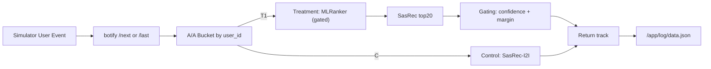

# Homework 2 Report

## Abstract

Goal: improve `botify` and beat `SasRec-I2I` in an honest A/B test on `mean_session_time`.
The final solution keeps control unchanged (`SasRec-I2I`) and uses an ML treatment with a conservative gating policy: treatment defaults to `SasRec top1` and only replaces it when the ML score has high confidence and clear margin. This reduced harmful aggressive reranking and produced statistically significant uplift in our final run.

## Details

### Online setup and constraints

- Control: `SasRec-I2I` (unchanged).
- Treatment: custom ML recommender (`MLRanker`) served in `botify`.
- Traffic source: simulator -> remote botify service (`/next`, `/last`), no direct use of `sim` module data as online logs.
- User history key is consistent with online i2i code: `user:{user}:listens`.

### Treatment model and serving logic

Model bundle (`ml_ranker_bundle.joblib`) predicts expected listen-time proxy from online-consistent features:

- `prev_track`
- `recommendation`
- `prev_time`
- `same_artist`
- `sasrec_rank_from_prev`
- `sasrec_rr_from_prev`
- `sasrec_candidate_count`

Serving strategy (important part):

1. Candidate pool is `SasRec top20` only.
2. Treatment baseline is generated by the same `SasRec-I2I` logic (`baseline_recommender`).
3. Candidates already listened by this user are filtered out before scoring.
4. Replacement happens only when all gates pass:
   - `prev_track_time >= 0.80`
   - `best_score > 0.78`
   - `best_score > baseline_score + 0.10`
5. Any feature/model/runtime issue falls back safely to baseline/random path without breaking service.

### System diagram

## A/B Experiment Results

Final run was performed on live simulator traffic with exported botify logs and analyzed via `analyze_ab.py`.
Experiment integrity check on exported logs:

- events: `12918` (`next=12051`, `last=867`)
- A/A bucket events: `C=6274`, `T1=6644`
- unique users: `824`
- cross-bucket users (`bad_users`): `0`

| metric | control_mean | treatment_mean | lift_pct | pvalue | significant | n_control | n_treatment |
|---|---:|---:|---:|---:|---|---:|---:|
| mean_session_time | 9.1984 | 10.7123 | +16.4579% | 0.00548 | true | 441 | 426 |

Conclusion: treatment beats control with statistically significant uplift on the target metric.
