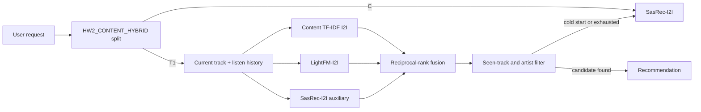

## Abstract

The treatment is a deterministic hybrid contextual recommender. Control remains the original SasRec-I2I recommender; treatment combines a new TF-IDF/cosine content item-to-item artifact built from Botify track metadata with the existing LightFM-I2I and SasRec-I2I lists, filters already listened tracks, prefers new artists, and falls back to SasRec-I2I for cold start or exhausted candidates.

## Details

Botify keeps a fair 50/50 A/B split: `C` is unchanged SasRec-I2I and `T1` is the proposed hybrid treatment. Offline, `content_i2i.jsonl` is generated from title, artist, genre, mood, country, and summary fields using sparse TF-IDF and cosine nearest neighbors. Online, the treatment tries the current track first, then historical tracks sorted by accumulated listen time, and fuses content, SasRec, and LightFM candidates with reciprocal-rank scoring.

## A/B Results

| Treatment | Metric | Control | Treatment | Lift | Significant |
|---|---|---:|---:|---:|---|
| HW2_CONTENT_HYBRID | mean_time_per_session | pending CI run | pending CI run | pending CI run | pending CI run |

Final CI/PR results will be copied into this table after the GitHub check finishes.
