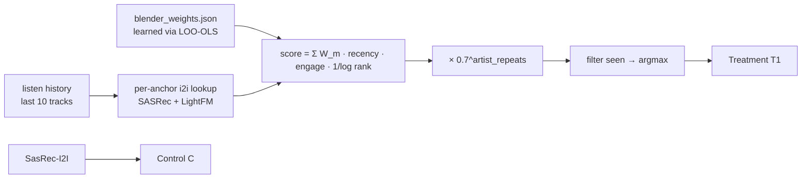

## Homework 2 Report — Session-aware онлайн-блендер SASRec+LightFM с artist-fatigue

### Abstract
В тритменте работает онлайн-рекомендер `SessionBlender`, который для каждого `/next`-запроса скорит кандидатов из соседей по **i2i-таблицам SASRec и LightFM**, взятых **по всей текущей истории** пользователя, а не по одному якорю. Веса двух моделей — **обученные** через leave-one-out OLS-регрессию (`jupyter/train_blender.py`, см. `botify/data/blender_weights.json`): `W_sasrec=1.0, W_lightfm=0.76`. Поверх i2i-скоров добавлены recency-затухание истории, вес по реальному `listen_time` якоря и штраф за повтор артиста `0.7^count_in_history`. Контроль `C` — чистый SasRec-I2I, тритмент `T1` — `SessionBlender`.

### Детали
Для каждого кандидата `c` и каждого якоря-трека `a` из истории считаем
`score(c) += W_m · recency(a) · (0.2 + listen_time(a)) · 1/log₂(2+rank_m(c,a))`
по моделям `m ∈ {SASRec, LightFM}`, где `recency(a) = 0.85^distance_from_latest`. После агрегации все кандидаты умножаются на `0.7^repeats`, где `repeats` — сколько раз артист кандидата уже встречался в последних 10 прослушиваниях юзера; это устраняет back-to-back одного исполнителя, которого симулятор штрафует. Финальный трек — `argmax`. Уже прослушанное фильтруется по списку history. Fallback — SasRec-I2I (при пустой истории или отсутствии соседей). ML-часть — офлайн-обучение весов: по каждой из 4 моделей (SASRec/EASE/HSTU/LightFM) по очереди прячем её top-10 и учим по трём остальным предсказывать, был ли трек в top-10 оракула; коэффициенты OLS усредняем и max-нормируем. Эксперимент сплит 50/50 (`Experiments.SESSION_BLENDER`).

### Результаты A/B эксперимента