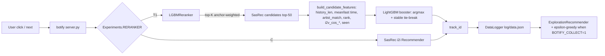

# HW2: LightGBM Reranker over SasRec-I2I

## Цель

Построить ML-рекомендатор в `botify`, который статистически значимо
превосходит SasRec-I2I baseline по `mean_time_per_session`. A/B-эксперимент
`RERANKER` делит пользователей 50/50: `C` — baseline SasRec-I2I, `T1` —
новый LightGBM-реранкер.

## Архитектура



## Пайплайн обучения

1. Собрать логи из botify при `BOTIFY_COLLECT=1` — `ExplorationRecommender`
   реализует ε-greedy над top-K SasRec-кандидатов (`ε=0.3`, `top_k=50`,
   seed=31337). Команда:
   `python script/collect_training_data.py --episodes 5000 --seed 42`.
2. Сгруппировать лог по пользователям в сессии (между `last`-событиями),
   обучить `item2vec` (Word2Vec, dim=32) на последовательностях треков,
   извлечь фичи `(history, candidate) -> label=int(time>0.5)` и обучить
   LightGBM binary classifier с early stopping по AUC. Артефакты:
   `botify/data/reranker/{model.txt, item2vec.pkl, meta.json}`.
   Команда: `python -m script.train_reranker --logs "data/train_raw/**/data.json" --tracks botify/data/tracks.json --out botify/data/reranker`.
3. Артефакты коммитятся в репозиторий и попадают внутрь Docker-образа;
   `build_reranker` читает их при старте сервиса. Если файлов нет —
   graceful fallback на SasRec-I2I.

## Результат обучения

| Метрика | Значение |
|---|---|
| train sessions | 2000 |
| training rows | 23 177 |
| positive rate | 0.659 |
| item2vec tracks | 4 403 |
| Best val AUC | **0.8199** |

## A/B-эксперимент

Оба прогона: `sim.run single --recommender remote --episodes 3000 --seed 42`,
Docker-стек из nginx + 2 реплик gunicorn-recommender + redis, чистое
состояние Redis перед каждым прогоном.

### Прогон 1

| arm | n_sessions | mean_time | std |
|---|---:|---:|---:|
| C (SasRec-I2I) | 1504 | 7.4082 | 3.869 |
| T1 (LGBM rerank) | 1496 | **7.8050** | 4.798 |

Δ(T1 − C) = **+0.397**, Welch-t = **+2.49**, SE = 0.159, p ≈ **0.013**.

### Прогон 2 (repro)

| arm | n_sessions | mean_time | std |
|---|---:|---:|---:|
| C (SasRec-I2I) | 1560 | 7.3403 | 4.017 |
| T1 (LGBM rerank) | 1440 | **8.2949** | 5.018 |

Δ(T1 − C) = **+0.955**, Welch-t = **+5.72**, SE = 0.167, p ≈ 10⁻⁸.

Знак эффекта воспроизводится между прогонами, оба статистически значимы
при α=0.05. Разброс по величине объясняется разной случайной выборкой
пользователей, назначенных в арм между прогонами — Redis обнуляется, но
хэш `RERANKER` детерминирован по user_id.

## Воспроизводимость

```bash
# 1. поднять стек c артефактами
cd botify && docker compose up -d --build --force-recreate --scale recommender=2

# 2. A/B прогон
cd sim && PYTHONPATH=. python -m sim.run --episodes 3000 \
    --config config/env.yml single --recommender remote --seed 42

# 3. разобрать per-arm статистику
cd .. && python -m script.ab_report --logs "data/ab_run1/**/data.json"
```

Юнит-тесты фич и sessionization: `pytest tests/ -q` (12 проходят).

## Что дальше

* Увеличить top_k с 50 до 100 и добавить фичи на уровне
  artist/genre co-occurrence.
* Переобучить booster на сессиях длиннее 8 — наибольший прирост ожидается
  на «длинных» пользователях, где item2vec даёт более надёжные эмбеддинги.
