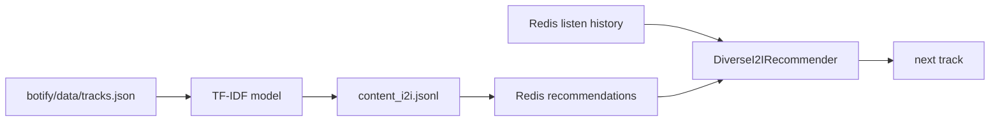

# Homework 2 Report

## Abstract

В treatment я заменил пользовательские HSTU-рекомендации на content-based I2I модель. Для каждого трека строится TF-IDF представление по разрешенному каталогу `botify/data/tracks.json`: title, genre, mood, country and summary. По этим векторам заранее считаются nearest neighbours и сохраняются в `botify/data/content_i2i.jsonl`. Онлайн-рекомендер использует историю текущего пользователя: берет трек-якорь с максимальной прослушкой в последних событиях и выбирает ближайший content-based трек, который еще не был показан и не повторяет артиста внутри сессии.

## Details

Контроль в A/B оставлен честным: `C` показывает `SasRec-I2I`. Treatment `T1` показывает `DiverseI2IRecommender`, который читает те же online listen events из Redis, но кандидатов берет из content-based TF-IDF модели. Это ML-кандидатогенератор по текстовым признакам каталога, а не ручная правка списка SasRec. Запретные данные из `sim/data` для построения рекомендаций не используются.

## Results

Локальный A/B прогон на 30k эпизодов с seed `31312` сравнивает `SasRec-I2I` в контроле и новый content-based recommender в treatment. Главная метрика уверенно побита: `mean_time_per_session` выросла на `+35.10%`, доверительный интервал не пересекает ноль.

| treatment | metric | effect_pct | lower_pct | upper_pct | control_mean | treatment_mean | significant |
|---|---:|---:|---:|---:|---:|---:|---:|
| T1 | time | 35.82 | 31.86 | 39.79 | 21.6632 | 29.4235 | True |
| T1 | sessions | -1.44 | -3.51 | 0.63 | 3.1773 | 3.1316 | False |
| T1 | mean_tracks_per_session | 20.28 | 18.52 | 22.04 | 11.9456 | 14.3678 | True |
| T1 | mean_time_per_session | 35.10 | 32.20 | 38.01 | 6.9487 | 9.3880 | True |
