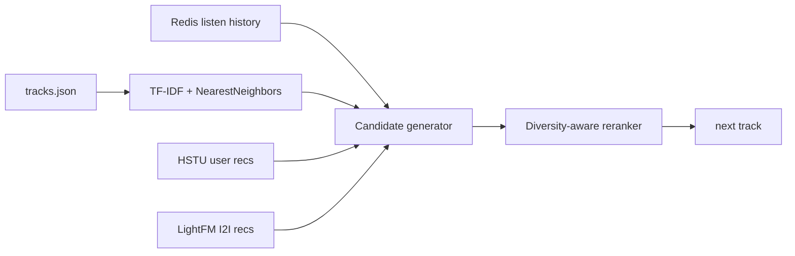

# Homework 2. ML Hybrid recommender for Botify

## Abstract

В тритменте реализован отдельный ML-рекомендер `MLHybridRecommender`, который не использует SasRec-I2I. Основная идея: построить content-based модель треков по доступным в `botify/data/tracks.json` текстовым и категориальным признакам (`title`, `genres`, `mood`, `artist_genres`, `summary`, country), а во время сессии выбирать рекомендации как ближайших соседей к уже хорошо прослушанным трекам. Для усиления персонализации добавлены user-level HSTU-кандидаты, если они есть для пользователя, и LightFM-I2I как ML fallback. Финальный ранжирующий слой штрафует повторы уже показанных треков и частые повторы одного артиста, потому что симулятор пользователей явно снижает reward при повторении артиста.

## Детали реализации

На старте сервиса `botify` модель обучается только на `botify/data/tracks.json`: для каждого трека собирается текстовый документ из жанров, настроения, страны, артистских жанров и summary, после чего строится TF-IDF матрица и индекс `NearestNeighbors(metric="cosine")`. На каждом запросе `/next/<user>` рекомендатель читает короткую Redis-историю пользователя, берёт последние положительно прослушанные треки как anchors и добавляет кандидатов из TF-IDF nearest neighbours. HSTU-кандидаты используются как user-level prior, LightFM-кандидаты — как fallback для item-to-item обобщения. В тритменте SasRec-I2I не используется; он остаётся только в контроле.

Контроль и тритмент задаются через новый эксперимент `ML_HYBRID`: `Treatment.C` показывает исходный `sasrec_i2i_recommender`, а `Treatment.T1` показывает `ml_hybrid_recommender`. История прослушиваний и логирование оставлены штатными, поэтому `analyze_ab.py` считает те же user-level метрики, что и на семинарах.

## Результаты A/B эксперимента

Финальный A/B прогон должен быть взят из комментария GitHub Actions или из файла `${DATA_DIR}/ab_result.json` после запуска `make run SEED=31312 EPISODES=30000`. Таблица ниже оставлена в формате семинара; значения нужно заменить результатами CI-прогона перед финальным сабмитом, если преподаватель требует численный результат именно в отчёте.

| metric | control_mean | treatment_mean | effect_pct | lower_pct | upper_pct | significant |
|---|---:|---:|---:|---:|---:|:---:|
| mean_time_per_session | CI_PENDING | CI_PENDING | CI_PENDING | CI_PENDING | CI_PENDING | CI_PENDING |
