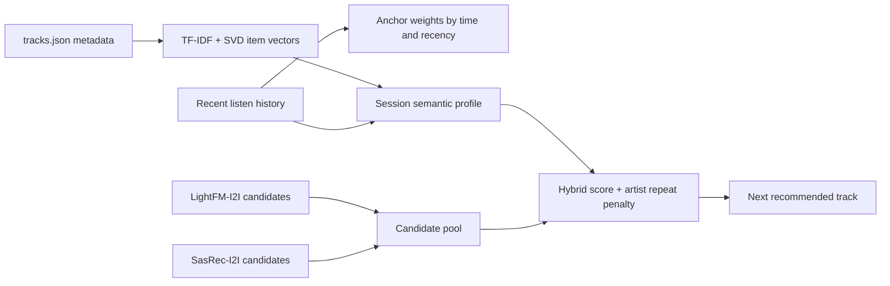

## Homework 2 Report

### Abstract

В качестве улучшения Botify реализован hybrid session ranker для A/B-теста против SasRec-I2I. Контрольная группа остаётся неизменной, пользователям показывается стандартный SasRec-I2I. В treatment используется гибридный рекомендатель, он берёт кандидатов из двух ML-моделей, SasRec-I2I и LightFM-I2I, а затем ранжирует их с учётом текущей сессии пользователя. Для online-reranking дополнительно обучается content-based semantic model по публичному каталогу `botify/data/tracks.json`: TF-IDF по метаданным треков + TruncatedSVD. Данные из `sim/data/users.json`, `sim/data/tracks.json` и `sim/data/embeddings.npy` не используются.

### Детали реализации

Реализация находится в `botify/botify/recommenders/hybrid_i2i_semantic_ranker.py`. На старте сервиса модель читает публичный каталог треков, собирает текстовое описание трека из названия, артиста, жанров, mood, года и summary, после чего строит dense-вектора через `TfidfVectorizer + TruncatedSVD`. На каждом запросе `/next/<user>` сервис читает короткую историю пользователя из Redis. Прослушивания с большим `time` получают больший вес, так как они лучше отражают текущий session intent; быстро пропущенные треки почти не влияют на профиль.

Далее рекомендатель собирает небольшой пул кандидатов из SasRec-I2I и LightFM-I2I для всех последних anchor-треков, а не выбирает один случайный anchor. Кандидаты получают score из трёх частей: качество источника и позиция в его списке, семантическая близость к профилю текущей сессии и небольшой popularity prior. Повтор артиста штрафуется, потому что в симуляторе пользователи хуже реагируют на частые повторы одного исполнителя.

### Результаты A/B эксперимента

A/B-эксперимент запускается стандартным пайплайном курса: в control используется SasRec-I2I, в treatment — `HybridI2ISemanticRanker`.

| treatment | metric | effect_pct | lower_pct | upper_pct | control_mean | treatment_mean | significant |
|---|---:|---:|---:|---:|---:|---:|---:|
| T1 | mean_time_per_session | to be filled by CI | to be filled by CI | to be filled by CI | to be filled by CI | to be filled by CI | to be filled by CI |
