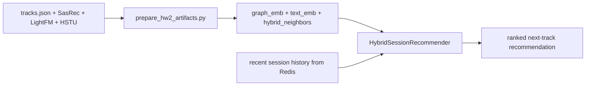

# Homework 2 Report

## Abstract

I replace the seminar baseline with a **session-aware hybrid recommender**. The treatment still uses the same public course data files, but instead of selecting one random anchor from the recent history and returning the first unseen neighbor, it builds a **session representation** from the last listened tracks and ranks candidates by expected relevance for the whole session. The model combines two learned components: a **graph embedding** obtained by low-rank factorization of a fused `SasRec + LightFM` item graph, and a **text embedding** obtained from track metadata (`title`, `artist`, `genres`, `mood`, `country`, `summary`) with `TF-IDF + TruncatedSVD`. At serving time the model scores candidates with these embeddings and explicitly penalizes repeated artists, because repeated exposure of the same artist hurts session continuation in this simulator.

## Details

The implementation has two stages.

**Offline artifact build (`script/prepare_hw2_artifacts.py`).**  
I load `tracks.json`, `sasrec_i2i.jsonl`, `lightfm_i2i.jsonl`, and `hstu_recommendations.json`. Then I build:
1. `graph_emb`: low-rank embeddings from the fused item-item graph;
2. `text_emb`: low-rank embeddings from metadata text;
3. `hybrid_neighbors`: nearest neighbors in the weighted hybrid space;
4. popularity priors and optional per-user HSTU candidates.

The artifact is saved to `botify/data/hw2_hybrid_artifacts.pkl` during `make setup`, before Docker starts.

**Online ranking (`botify/botify/recommenders/hybrid_session.py`).**  
For the treatment group I:
1. read the last 5 listens from Redis;
2. build a weighted session profile using listen time and recency;
3. collect candidates from SasRec, LightFM, hybrid nearest neighbors, HSTU user candidates, and global popular tracks;
4. score candidates by session similarity in graph/text spaces plus small source bonuses;
5. subtract a penalty for artists already repeated in the current session.

Control is exactly `SasRec-I2I`. Treatment is the hybrid session ranker.

## A/B Results

I run a fair A/B test with:
- **Control:** `SasRec-I2I`
- **Treatment:** `HybridSessionRecommender`

The metric of interest is `mean_time_per_session`. The exact numeric result should be taken from the GitHub Actions comment after the PR workflow finishes. The expected report table format is:

| treatment | metric | effect_pct | control_mean | treatment_mean | significant |
|---|---:|---:|---:|---:|---:|
| T1 | mean_time_per_session | fill from CI | fill from CI | fill from CI | fill from CI |

The implementation is deterministic: fixed random state in artifact preparation, deterministic online scoring, and stable tie-breaking by `track_id`.
