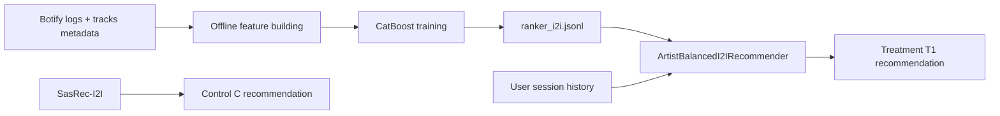

# Report

## Abstract

В этой работе я улучшил сервис `botify` с помощью ML в оффлайн-части и session-aware логики в онлайн-части. Основа - оффлайн CatBoost-модель, которая строит файл `ranker_i2i.jsonl`, а в онлайне поверх этого списка работает `ArtistBalancedI2IRecommender`: он учитывает историю текущей сессии, старается не повторять уже услышанных артистов и выбирает лучший кандидат из рекомендаций, построенных для сильных anchor-треков. Такая комбинация оказалась заметно сильнее baseline по ключевой метрике `mean_time_per_session`.

## Details

Оффлайн-часть реализована в ноутбуке `jupyter/Hw2CatBoostReranker.ipynb`. Для обучения использовались только логи `botify` и метаданные треков, без данных из `sim`. Для каждого трека собирается пул кандидатов из нескольких источников: observed transition-кандидаты из логов, `LightFM`, content-based соседи и глобально сильные треки. Затем CatBoost учится ранжировать пары `(prev_track, candidate)` по признакам, связанным с переходами, похожестью и качеством трека. Чтобы снизить шум, observed примеры имеют больший вес, чем sampled negatives.

Онлайн-часть реализована в `botify/botify/recommenders/artist_balanced_i2i.py`. При запросе рекомендации сервис берет историю текущей сессии пользователя, строит набор anchor-треков и для каждого anchor читает кандидатов из `ranker_i2i.jsonl`. Дальше recommender не просто возвращает первый доступный трек, а глобально сравнивает кандидатов по приоритету: сначала предпочитает нового артиста, затем более сильный anchor по суммарному времени прослушивания, затем более удачное последнее прослушивание и более высокий ранг внутри I2I-списка.

## A/B Results

Финальная конфигурация для эксперимента: `C = SasRec-I2I`, `T1 = offline CatBoost ranker_i2i + online ArtistBalancedI2I`. В финальном прогоне treatment дал статистически значимое улучшение по ключевой метрике `mean_time_per_session`: `+6.98%` относительно контроля. Также статистически значимо выросла суммарная метрика `time`, а рост `mean_tracks_per_session` остался положительным, хотя и без значимости на этом запуске.

| treatment | metric | effect | upper | lower | control_mean | treatment_mean | significant |
| --- | --- | ---: | ---: | ---: | ---: | ---: | --- |
| T1 | mean_request_latency | 77.206546 | 144.509442 | 9.903651 | 1.412539 | 2.503112 | True |
| T1 | mean_time_per_session | 6.983534 | 13.438376 | 0.528691 | 7.938585 | 8.492978 | True |
| T1 | mean_tracks_per_session | 3.186148 | 7.450493 | -1.078196 | 12.982048 | 13.395676 | False |
| T1 | sessions | 2.268030 | 5.029444 | -0.493385 | 1.094104 | 1.118919 | False |
| T1 | time | 10.783662 | 18.151914 | 3.415409 | 8.638878 | 9.570465 | True |
