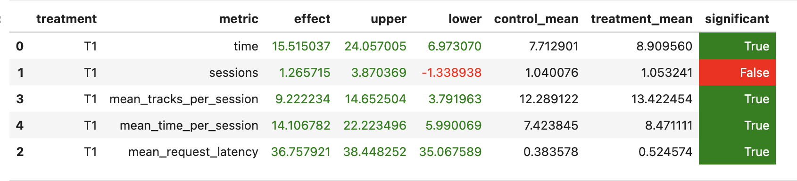

# Отчет по ДЗ 2

## Abstract

Я попробовала улучшить бейзлайн SasRec-I2I с помощью гибридного рекомендера. 
В контроле оставила обычный SasRec-I2I, а в treatment добавила HSTUHybridRecommender: 
он в основном опирается на SasRec, но немного учитывает рекомендации HSTU. 

## Детали реализации

HSTUHybridRecommender берет историю прослушиваний пользователя из Redis 
и по ней подбирает кандидатов. Основу я оставила от SasRec-I2I, потому что он и так довольно сильный, 
а HSTU добавила как небольшой дополнительный ML-сигнал с весом 0.2. 
Дальше кандидаты объединяются через Reciprocal Rank Fusion: 
чем выше трек стоит в рекомендациях модели, тем больше у него итоговый скор. 
LightFM в финальной версии я отключила, потому что на локальных прогонах он 
только ухудшал mean_session_time. В итоге я оставила более осторожный вариант, 
где HSTU немного помогает, но не перебивает SasRec.

```text
История пользователя
        |
        v
Последний прослушанный трек / недавние anchor-треки
        |
        
SasRec-I2I кандидаты  +  HSTU кандидаты
        |
        v
Reciprocal Rank Fusion с весами
        |
        v
Фильтрация уже прослушанных треков
        |
        v
Итоговая рекомендация
```

## Результаты A/B-эксперимента

Метрика — `mean_session_time` (в табличке `time`).

T1-группа показала статистически значимое улучшение относительно контроля: среднее время выросло с `7.71` до `8.9`, относительный эффект составил `+15.5%`. 
Также выросли среднее число треков за сессию и среднее время сессии.



Итог: Эксперимент считается успешным.
