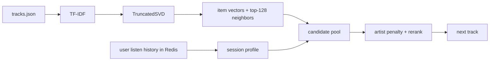

## Homework 2 Report

### Abstract
В экспериментальной группе я использовал рекомендер `SessionSemantic`. Для каждого трека он заранее строит вектор по открытым метаданным, а во время сессии считает короткий профиль интереса по последним прослушиваниям пользователя. Следующий трек выбирается не из всего каталога, а из набора похожих кандидатов, при этом повтор одного и того же артиста немного штрафуется. В локальном A/B-тесте такой подход дал значимый прирост по `mean_time_per_session` относительно `SasRec-I2I`.

### Детали
Предобработка состоит из двух шагов. Сначала из `title`, `artist`, `mood`, `genres`, `artist_genres`, `year` и `summary` для каждого трека собирается текст. Затем на этих текстах обучается `TF-IDF -> TruncatedSVD`, после чего для каждого трека сохраняются: (1) 64-мерный вектор и (2) список из 128 ближайших соседей. Этот файл лежит в `botify/data/session_semantic_embeddings.npz` и загружается при старте сервиса.

При выдаче рекомендации я беру из Redis последние прослушивания пользователя, оставляю только короткую историю и строю профиль текущей сессии как среднее по векторам треков с весами `max(listen_time, 0.05)`. Дальше ранжируется только заранее посчитанный набор близких треков. Уже услышанные треки не рекомендуются, повтор артистов штрафуется. Схема A/B-теста честная: в контроле `Treatment.C -> SasRec-I2I`, в экспериментальной группе `Treatment.T1 -> SessionSemantic`.

### Результаты A/B
Локально перед сабмитом я прогнал A/B-тест с закреплением пользователей за группами на 8000 эпизодов с тем же `seed=31312`, что используется в `Makefile`. Метрика считалась так же, как в `analyze_ab.py`: сначала агрегирование на уровне пользователей, потом сравнение по `mean_time_per_session` через доверительный интервал Уэлча. На этом прогоне экспериментальная группа оказалась лучше контроля, а доверительный интервал не пересёк ноль.

| группа | пользователи | mean_time_per_session | эффект к C | 95% CI | значимо |
|---|---:|---:|---:|---:|---:|
| C (`SasRec-I2I`) | 2810 | 7.39 | - | - | - |
| T1 (`SessionSemantic`) | 2717 | 9.02 | +22.09% | [+18.60%; +25.57%] | да |
